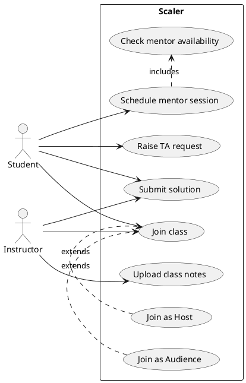

# Strategy design pattern and UML diagrams

- [Strategy design pattern and UML diagrams](#strategy-design-pattern-and-uml-diagrams)
  - [Strategy design pattern](#strategy-design-pattern)
    - [Implementation](#implementation)
    - [Recap](#recap)
  - [UML diagrams](#uml-diagrams)
    - [Structural diagrams](#structural-diagrams)
    - [Behavioral diagrams](#behavioral-diagrams)
      - [Use case diagram](#use-case-diagram)
  - [Assignment](#assignment)
    - [Solution](#solution)

## Strategy design pattern

> The strategy pattern (also known as the policy pattern) is a software design pattern that enables an algorithm's behavior to be selected at runtime. The strategy pattern encapsulates alternative algorithms (or strategies) for a specific task and supports their interchangeable use. The strategy pattern lets the algorithm vary independently from clients that use it.

Today we are building a navigation system for a car. The navigation system should be able to calculate the shortest route between two points and tell the driver how to get there.
We start with a simple implementation that only supports driving on roads and hence we design a simple `RoadNavigation` class that calculates the shortest route between two points on a road.

```java
public class Navigator {
    public void navigate(Point from, Point to) {
        ...
    }
}
```

Our application is a hit and we get a lot of requests to support other types of navigation such as using a bike or walking. In order to support various types of navigation we introduce a new `ModeType` enum that defines the different types of navigation.

```java
public class Navigator {
    public void navigate(Point from, Point to, ModeType mode){
        if (mode == ModeType.ROAD) {
            ...
        } else if (mode == ModeType.BIKE) {
            ...
        } else if (mode == ModeType.WALK) {
            ...
        }
    }
}
```

This works but it is not very flexible. If we want to add a new type of navigation we have to modify the `navigate` method. This is an example of a violation of the open-closed principle. Similarly, the method has multiple reasons to change, and we have to test it for all the different types of navigation.

We could create an interface and have a separate class for each type of navigation. This would solve the problem of having to modify the `navigate` method, but inheritance is static and we cannot change the behavior of the `navigate` method at runtime. Also code duplication is a problem.
This is where the strategy pattern comes in. The strategy pattern allows us to encapsulate the different types of navigation in separate classes and select the appropriate one at runtime. The Strategy pattern suggests that you take a class that does something specific in a lot of different ways and extract all of these algorithms into separate classes called strategies. The original class, called context, must have a field for storing a reference to one of the strategies. The context delegates the work to a linked strategy object instead of executing it on its own.

### Implementation

1. `Strategy` interface - defines an algorithm interface common to all supported versions.

```java
public interface NavigationStrategy {
    void navigate(Point from, Point to);
}
```

2. `Concrete Strategy` classes - implement the algorithms using the Strategy interface.

```java
public class RoadNavigation implements NavigationStrategy {
    @Override
    public void navigate(Point from, Point to) {
        ...
    }
}
```

3. `Context` class - maintains a reference to a Strategy object and defines an interface that lets the strategy access its data.

```java
public class Navigator {
    private NavigationStrategy strategy;

    public Navigator(NavigationStrategy strategy) {
        this.strategy = strategy;
    }

    public void navigate(Point from, Point to) {
        strategy.navigate(from, to);
    }
}
```

4. `Client` - creates and configures the context and the strategy objects.

```java
public class Main {
    public static void main(String[] args) {
        Navigator navigator = new Navigator(new RoadNavigation());
        navigator.navigate(new Point(0, 0), new Point(10, 10));
    }
}
```

To create a strategy object we can also use a factory method.

### Recap
* The strategy pattern encapsulates alternative algorithms (or strategies) for a specific task and supports their interchangeable use.
* Implementing it in place violates the open-closed principle and makes the code harder to maintain.
* Inheritance is static, and we cannot change the behavior of the system at runtime.
* To use the strategy pattern we create a strategy interface and a set of classes that implement it.
* The context class maintains a reference to a strategy object and delegates the work to it.

## UML diagrams

> UML is a general-purpose, developmental, modeling language in the field of software engineering that is intended to provide a standard way to visualize the design of a system.

Maintainability is a key factor in software development.
A codebase is worked on by many people over a long period of time. For a new developer to be able to understand the codebase, it is important to have a good documentation. UML diagrams are a good way to document the design of a system.
Apart from documentation, UML diagrams are also used to communicate the design of a system to other developers.
It is very important to document our design decisions so that we can refer to them later and even get feedback from other developers.

UML diagrams are a great way to visualize the design of a system. They are a great way to communicate with other developers and stakeholders. They are also a great way to document the design of a system. There are two main types of UML diagrams - 
* `Structural diagrams` - These diagrams are used to describe the structure of a system. They are used to describe the classes and objects in a system. They are also used to describe the relationships between classes and objects.
* `Behavioral diagrams` - These diagrams are used to describe the behavior of a system. They are used to describe the interactions between classes and objects. They are also used to describe the sequence of events in a system.

### Structural diagrams

> Structural diagrams are used to describe the structure of a system. They are used to describe the classes and objects in a system. They are also used to describe the relationships between classes and objects.

There are four main types of structural diagrams -
* `Class diagram` - This diagram is used to describe the classes and objects in a system. It is also used to describe the relationships between classes and objects.
* `Object diagram` - This diagram is used to describe the objects in a system. It is also used to describe the relationships between objects.
* `Component diagram` - This diagram is used to describe the components in a system. It is also used to describe the relationships between components.
* `Package diagram` - This diagram is used to describe the packages in a system. It is also used to describe the relationships between packages.

### Behavioral diagrams

> Behavioral diagrams are used to describe the behavior of a system. They are used to describe the interactions between classes and objects. They are also used to describe the sequence of events in a system.

There are four main types of behavioral diagrams -
* `Use case diagram` - This diagram is used to describe the use cases in a system and the actors that interact with the system.
* `Sequence diagram` - This diagram is used to describe the sequence of events in a system.
* `Activity diagram` - This diagram is used to describe the flow of control in a system.
* `State diagram` - This diagram is used to describe the state of an object in a system.

Learn more about different types of UML diagrams [here](https://creately.com/blog/diagrams/uml-diagram-types-examples/).

#### Use case diagram

> A use case diagram is a behavioral diagram that is used to describe the use cases in a system and the actors that interact with the system.

Use case diagrams give a graphic overview of the actors involved in a system, different functions needed by those actors and how these different functions interact. It’s a great starting point for any project discussion because you can easily identify the main actors involved and the main processes of the system.

Some main components of a use case diagram are -
* `System boundary` - This is the boundary of the system. It is the boundary of the system that we are designing. It contains all the use cases that are part of the system. All the internal elements of the system are part of the system boundary, but the external elements are not part of the system boundary.
* `Use case` - This represents a functionality or a feature that is supported by a system. A use case is represented by an ellipse/oval. The name of the use case is written inside the ellipse/oval.
* `Actor` - This represents a person or a system that interacts with the system. An actor is represented by a stick figure.
* `Relationships` - Not all use cases will be available for all actors. For instance, a user can login but cannot change their email. An admin can login and change emails. We draw a line between actors and their supported use cases to represent the relationships between them.
* `Include` - This is a relationship between two use cases. It represents that one use case is a subset of another use case. For instance, a use case to create an order has a dependency on the payment use case. We draw an arrow from the create order use case to the payment use case to represent this relationship.
* `Extend` - This is a relationship between two use cases. It represents that one use case can be extended by another use case. For instance, there can be multiple ways to login such as login with email, login with phone number, login with social media. We draw an arrow from the different login use cases to the login use case to represent this relationship.

## Assignment

* Draw a use case diagram for Scaler Academy.
* Your use case diagram should have at least 5 use cases.
* Your use case diagram should have at least 2 actors.
* Introduce a use case that should depend on another use case. (Use include relationship)
* Introduce a use case that should extend another use case. (Use extend relationship)

### Solution

Actors -
* `Student`
* `Instrcutor`

Use cases -
* Join class
* Schedule mentor session
* Raise TA request
* Upload class notes
* Submit solution
* `Check mentor availability`
* `Check plagiarism`
* `Join as Host`
* `Join as Audience`

Include relationship -
* Schedule mentor session depends on `Check mentor availability`
* Submit solution depends on `Check plagiarism`

Extend relationship -
* `Join as Host` extends `Join class`
* `Join as Audience` extends `Join class`



Learn more about PlantUML [here](https://plantuml.com/).