# UML diagrams and schema design

- [UML diagrams and schema design](#uml-diagrams-and-schema-design)
  - [UML diagrams](#uml-diagrams)
    - [Structural diagrams](#structural-diagrams)
    - [Behavioral diagrams](#behavioral-diagrams)
      - [Use case diagram](#use-case-diagram)
    - [Assignment](#assignment)
    - [Solution](#solution)
  - [Learn more about PlantUML here.](#learn-more-about-plantuml-here)
  - [Class diagram](#class-diagram)
    - [Entities and attributes](#entities-and-attributes)
      - [Attributes](#attributes)
      - [Methods](#methods)
      - [Interfaces and abstract classes](#interfaces-and-abstract-classes)
    - [Relationships](#relationships)
      - [Cardinality](#cardinality)
  - [Schema Design - Case Study](#schema-design---case-study)
    - [ReScaler - Case Study](#rescaler---case-study)
    - [Class Diagram](#class-diagram-1)
    - [Database Schema](#database-schema)
    - [Adding a new feature](#adding-a-new-feature)
      - [Course Name as an attribute](#course-name-as-an-attribute)
      - [Course as a separate entity](#course-as-a-separate-entity)
    - [Cardinality - Caveats](#cardinality---caveats)
      - [Caveat 1: NULL values](#caveat-1-null-values)
      - [Caveat 2: Relations with attributes](#caveat-2-relations-with-attributes)
      - [Recap](#recap)
    - [Adding a new feature - II](#adding-a-new-feature---ii)
  - [Recap](#recap-1)
  - [Take Home Exercise](#take-home-exercise)

## UML diagrams

> UML is a general-purpose, developmental, modeling language in the field of software engineering that is intended to provide a standard way to visualize the design of a system.

Maintainability is a key factor in software development.
A codebase is worked on by many people over a long period of time. For a new developer to be able to understand the codebase, it is important to have a good documentation. UML diagrams are a good way to document the design of a system.
Apart from documentation, UML diagrams are also used to communicate the design of a system to other developers.
It is very important to document our design decisions so that we can refer to them later and even get feedback from other developers.

UML diagrams are a great way to visualize the design of a system. They are a great way to communicate with other developers and stakeholders. They are also a great way to document the design of a system. There are two main types of UML diagrams - 
* `Structural diagrams` - These diagrams are used to describe the structure of a system. They are used to describe the classes and objects in a system. They are also used to describe the relationships between classes and objects.
* `Behavioral diagrams` - These diagrams are used to describe the behavior of a system. They are used to describe the interactions between classes and objects. They are also used to describe the sequence of events in a system.

### Structural diagrams

> Structural diagrams are used to describe the structure of a system. They are used to describe the classes and objects in a system. They are also used to describe the relationships between classes and objects.

There are four main types of structural diagrams -
* `Class diagram` - This diagram is used to describe the classes and objects in a system. It is also used to describe the relationships between classes and objects.
* `Object diagram` - This diagram is used to describe the objects in a system. It is also used to describe the relationships between objects.
* `Component diagram` - This diagram is used to describe the components in a system. It is also used to describe the relationships between components.
* `Package diagram` - This diagram is used to describe the packages in a system. It is also used to describe the relationships between packages.

### Behavioral diagrams

> Behavioral diagrams are used to describe the behavior of a system. They are used to describe the interactions between classes and objects. They are also used to describe the sequence of events in a system.

There are four main types of behavioral diagrams -
* `Use case diagram` - This diagram is used to describe the use cases in a system and the actors that interact with the system.
* `Sequence diagram` - This diagram is used to describe the sequence of events in a system.
* `Activity diagram` - This diagram is used to describe the flow of control in a system.
* `State diagram` - This diagram is used to describe the state of an object in a system.

Learn more about different types of UML diagrams [here](https://creately.com/blog/diagrams/uml-diagram-types-examples/).

#### Use case diagram

> A use case diagram is a behavioral diagram that is used to describe the use cases in a system and the actors that interact with the system.

Use case diagrams give a graphic overview of the actors involved in a system, different functions needed by those actors and how these different functions interact. It’s a great starting point for any project discussion because you can easily identify the main actors involved and the main processes of the system.

Some main components of a use case diagram are -
* `System boundary` - This is the boundary of the system. It is the boundary of the system that we are designing. It contains all the use cases that are part of the system. All the internal elements of the system are part of the system boundary, but the external elements are not part of the system boundary.
* `Use case` - This represents a functionality or a feature that is supported by a system. A use case is represented by an ellipse/oval. The name of the use case is written inside the ellipse/oval.
* `Actor` - This represents a person or a system that interacts with the system. An actor is represented by a stick figure.
* `Relationships` - Not all use cases will be available for all actors. For instance, a user can login but cannot change their email. An admin can login and change emails. We draw a line between actors and their supported use cases to represent the relationships between them.
* `Include` - This is a relationship between two use cases. It represents that one use case is a subset of another use case. For instance, a use case to create an order has a dependency on the payment use case. We draw an arrow from the create order use case to the payment use case to represent this relationship.
* `Extend` - This is a relationship between two use cases. It represents that one use case can be extended by another use case. For instance, there can be multiple ways to login such as login with email, login with phone number, login with social media. We draw an arrow from the different login use cases to the login use case to represent this relationship.
---

### Assignment

* Draw a use case diagram for Scaler Academy.
* Your use case diagram should have at least 5 use cases.
* Your use case diagram should have at least 2 actors.
* Introduce a use case that should depend on another use case. (Use include relationship)
* Introduce a use case that should extend another use case. (Use extend relationship)

### Solution

Actors -
* `Student`
* `Instrcutor`

Use cases -
* Join class
* Schedule mentor session
* Raise TA request
* Upload class notes
* Submit solution
* `Check mentor availability`
* `Check plagiarism`
* `Join as Host`
* `Join as Audience`

Include relationship -
* Schedule mentor session depends on `Check mentor availability`
* Submit solution depends on `Check plagiarism`

Extend relationship -
* `Join as Host` extends `Join class`
* `Join as Audience` extends `Join class`

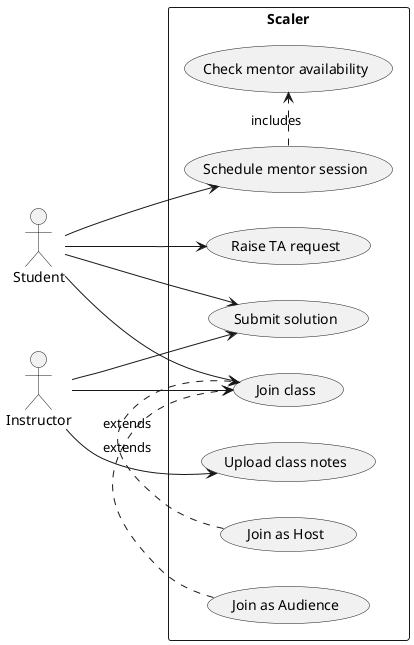

Learn more about PlantUML [here](https://plantuml.com/).
---

## Class diagram

A class diagram is a graphical representation of a system's low level implementation and describes the relationships between the various components of the system. A class diagram represents the following components of a system:
* Classes
* Interfaces
* Abstract classes

The following data points about the relationships between the components are also represented:
* Which classes implement which interfaces?
* Which class is a subclass?
* Which class is a superclass?
* Which class is an attribute of another class?

### Entities and attributes

A class is represented by a rectangle with the name of the class in the middle. The attributes and methods of the class are presented in the rectangle. The attributes are presented in the top half of the rectangle and the methods are presented in the bottom half of the rectangle.

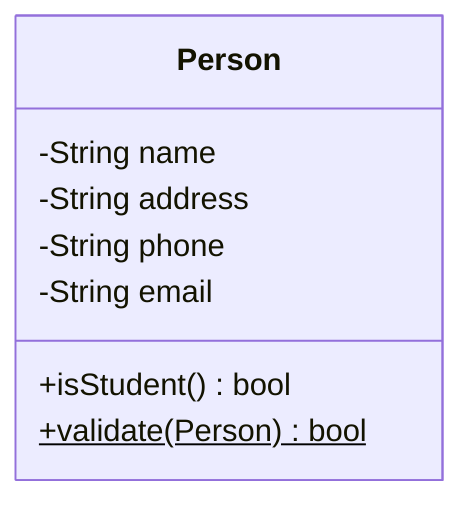

#### Attributes

Attributes are the properties of a class. An attribute is represented in the form of 
> [access modifier] [attribute name]: [attribute type]
The following are parts of an attribute:
* `Access modifier` - Visibility of the attribute. It can be one of the following:
  * `+` public
  * `-` private
  * `#` protected
  * `~` package
* `Attribute name` - Name of the attribute
* `Attribute type` - Type of the attribute. It can be a primitive type or a class type.

#### Methods

Methods are the operations that can be performed on a class. A method is represented in the form of
> [access modifier] [method name]([parameter list]): [return type]

The following are parts of a method:
* `Access modifier` - Visibility of the method. Same as the access modifier of an attribute.
* `Method name` - Name of the method
* `Parameter list` - List of parameters that the method takes but instead of the parameter name, the parameter type is used. The parameters are separated by commas.
* `Return type` - Type of the value returned by the method. It can be a primitive type or a class type.

Static methods and attributes are underlined.

#### Interfaces and abstract classes

An interface is a contract that a class must implement. An interface is represented by a rectangle with the name of the interface in the middle surrounded by an angled bracket. The methods of the interface are presented in the rectangle.

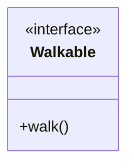

Similarly, abstract classes and methods are italicized.

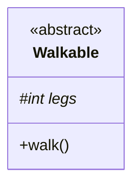

### Relationships

There are 2 major types of relationships between classes:
* `Inheritance` - A relationship between a superclass and a subclass. The subclass inherits the attributes and methods of the superclass.
* `Association` - A relationship between 2 classes. The classes are associated with each other. The association can be one of the following:
  * `Aggregation` - A relationship between 2 classes where the lifetime of the child class is dependent on the lifetime of the parent class. The child class can exist without the parent class.
  * `Composition` - A relationship between 2 classes where the lifetime of the child class is dependent on the lifetime of the parent class. The child class cannot exist without the parent class.

Inheritance is represented by a line with an arrow pointing to the superclass. Sometimes the arrow is replaced by a triangle.

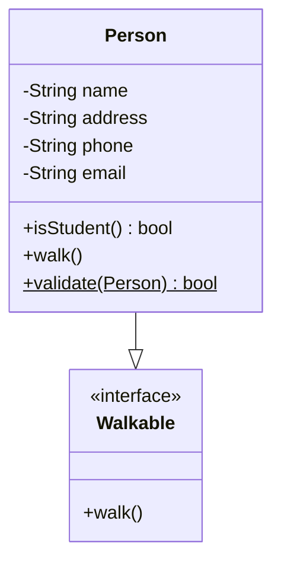

Aggregation is represented by a line with a diamond at the end of the line.

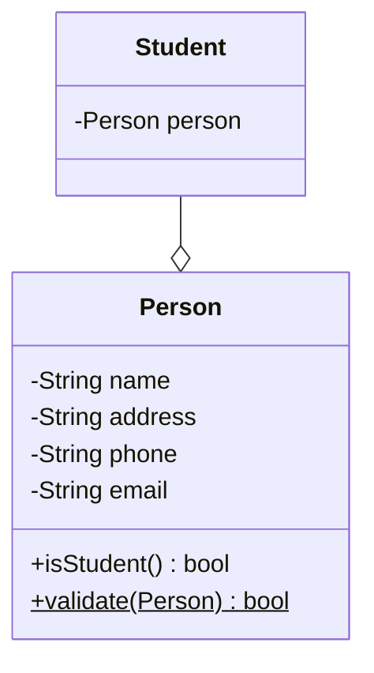

Composition is represented by a line with a filled diamond at the end of the line.

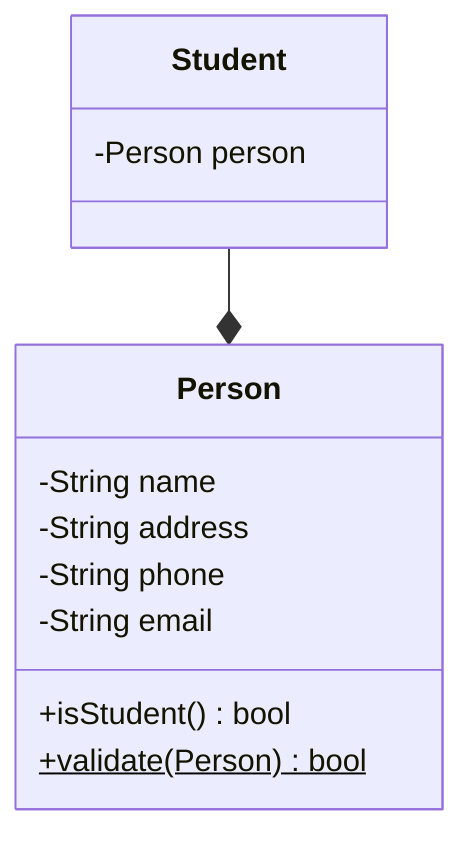

#### Cardinality

> Cardinality is the maximum times an entity can relate to an instance with another entity or entity set.

> the number of interactions entities have with each other.

**One to One (1:1)**
>  A "one-to-one" relationship is seen when one instance of entity 1 is related to only one instance of entity 2 and vice-versa

A student can only have one email address and one email address can be associated with only one student.

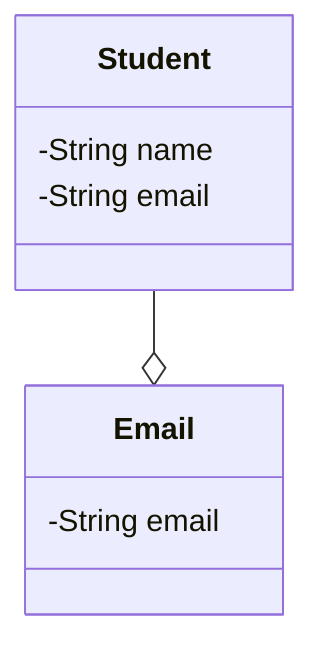

An attribute shared by both entities can be added to either of the entities.

**One to Many or Many to one (1:m or m:1)**
> When one instance of entity 1 is related to more than one instance of entity 2, the relationship is referred to as "one-to-many.

A student can only be associated with one batch, but a batch can have many students.

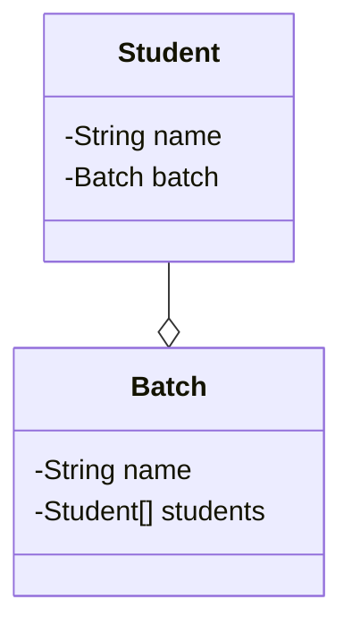

An attribute shared by both entities can only be added to the entity which has multiple instances i.e. the M side.

**Many to Many (m:n)**

> When multiple instances of entity 1 are linked to multiple instances of entity 2, we have a "many-to-many" relationship. Imagine a scenario where an employee is assigned more than one project.

A student can attend multiple classes and a class can have multiple students.

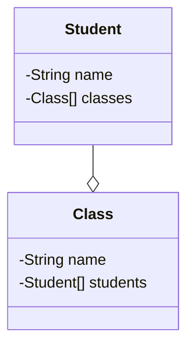

## Schema Design - Case Study

> A schema is a blueprint or plan for a database. It is a collection of logical structures of data, or schema objects, that determine how data is stored and accessed. A schema is a collection of logical structures of data, or schema objects, that determine how data is stored and accessed.

Often, after we build our class diagram, we will need to convert it into a database schema. This is because the database is the most common way to store data. The database schema is the structure of the database. It is the blueprint of the database. It defines the tables, columns, and relationships between the tables.
Roughly the questions answered by the schema are:
* What data do we need to store corresponding to the request?
* What are different tables we need to create?
* What are the columns in each table?
* What are the keys in each table?

### ReScaler - Case Study

Following are the requirements of the ReScaler application:
* A student should be able to login with their email address and password.
* Students should be able to view their profile which includes their name, email address and phone number.

### Class Diagram

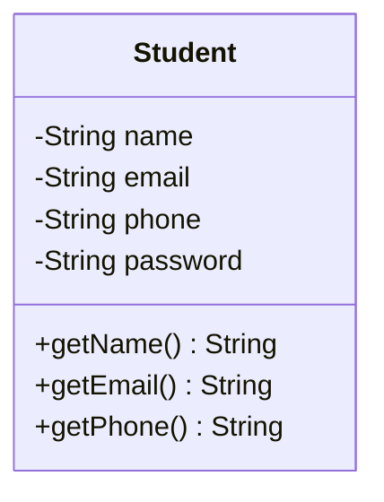

### Database Schema

Map the classes as it is to a table in the database. The attributes of the class become the columns of the table.

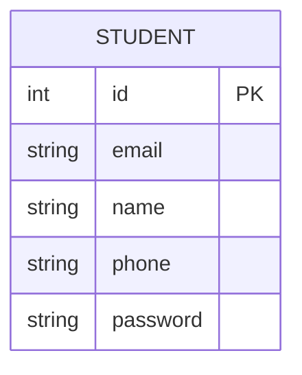

### Adding a new feature

* We will provide multiple courses as a part of the ReScaler application.
* Every student can enroll for a single course.
* Every course has a name.

#### Course Name as an attribute

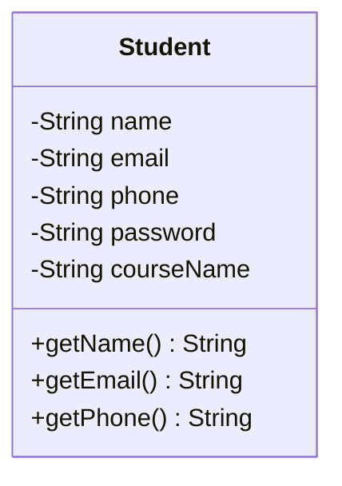

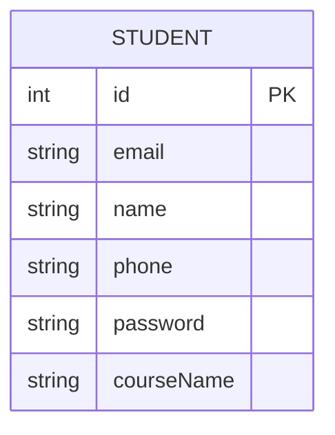

Disadvantages:
* The student can only enroll for a single course.
* Course name is duplicated for every student in the same course. This is a waste of space.
* Updating the course name for all the students is a tedious task.
* Course cannot exist without a student. Our design is subject to database anomalies.

#### Course as a separate entity

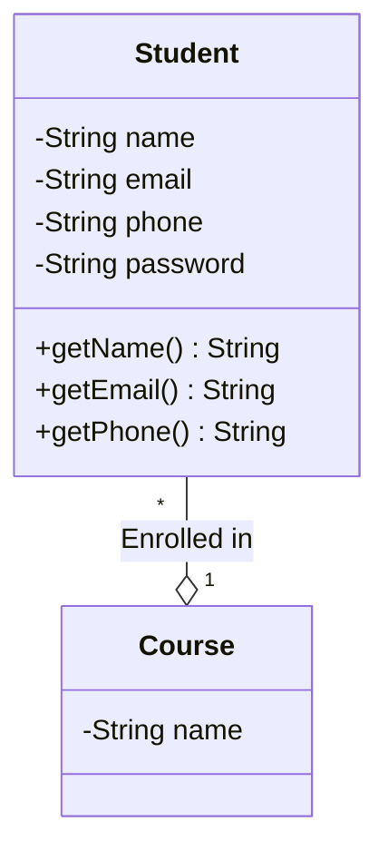

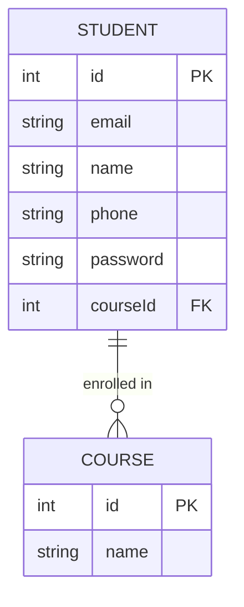

### Cardinality - Caveats
#### Caveat 1: NULL values

Often, when a relationship is not present, we use `NULL` values. For example, a student may not have a mentor. In this case, the `mentor_id` field in the `students` table will be `NULL`. This is a valid value for a foreign key.

If a table has a lot of NULL values for a foreign key, it is a good idea to create a new mapping table. For example, a student can have a `mentor_id` field with NULL values, we can create a new table `student_mentor`:
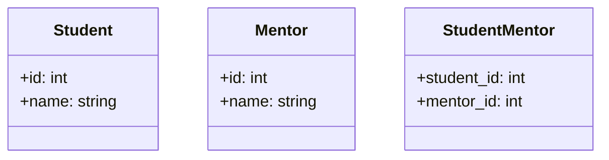

#### Caveat 2: Relations with attributes

Sometimes, a relationship has attributes. For example, a student can have multiple batches. In this case, we can add a `joining_date` and `leaving_date` field to the `student_batch` table.

If the relation attributes are added to the main table, it can get polluted and add to the latency of the table. A better approach is to create a new table with the relation attributes.

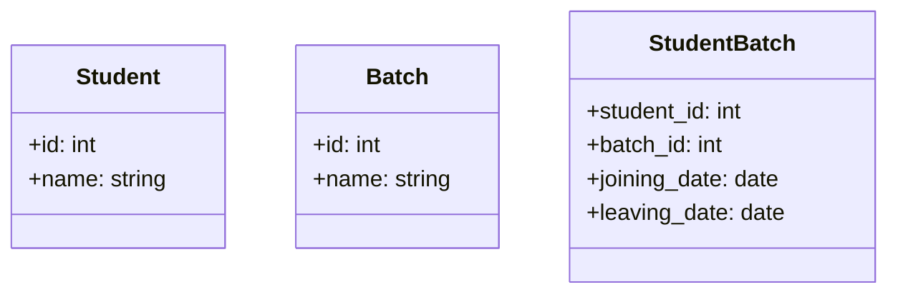

#### Recap

| Cardinality | Normal Relation                                 | Sparse Relation | Relation with Attributes | Example         |
| ----------- | ----------------------------------------------- | --------------- | ------------------------ | --------------- |
| 1:1         | Add foreign key on any table                    | Mapping Table   | Mapping Table            | Student - Email |
| 1:M         | Add foreign key on M side referencing the other | Mapping Table   | Mapping Table            | Student - Batch |
| M:N         | Mapping Table                                   | Mapping Table   | Mapping Table            | Student - Class |

### Adding a new feature - II

* A student can now enroll for multiple courses.

In our previous design, we had a `course_id` field in the `students` table. This is a good design for a single course. But, if we want to enroll for multiple courses, the cardinality changes to `M:N`. We need to create a mapping table.

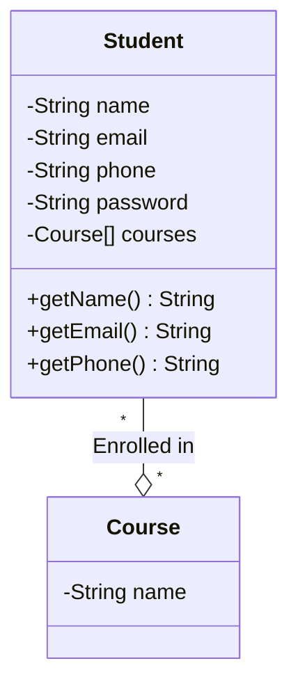

As we have seen in the case of many-to-many relations, we need to create a mapping table. 

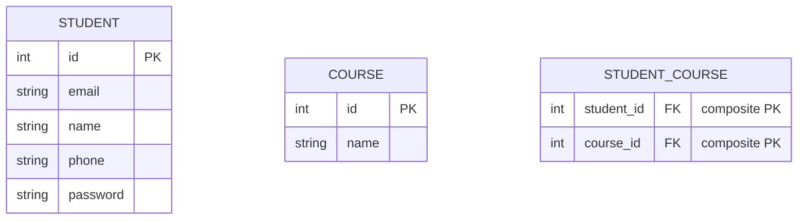

## Recap

1. Identify all the classes in the application.
2. Make a class diagram.
3. Make a table for each class.
4. For all the classes, identify the cardinality of the relationships.
5. Check if any attribute is required to represent the relationship.

## Take Home Exercise

Design the class Diagram and database Schema for a system like Netflix with following Use Cases.

* Netflix has users.
* Every user has an email and a password.
* Users can create profiles to have separate independent environments.
* Each profile has a name and a type. Type can be KID or ADULT.
* There are multiple videos on netflix.
* For each video, there will be a title, description and a cast.
* A cast is a list of actors who were a part of the video. For each actor we need to know their name and list of videos they were a part of.
* For every video, for any profile who watched that video, we need to know the status (COMPLETED/ IN PROGRESS).
* For every profile for whom a video is in progress, we want to know their last watch timestamp.
