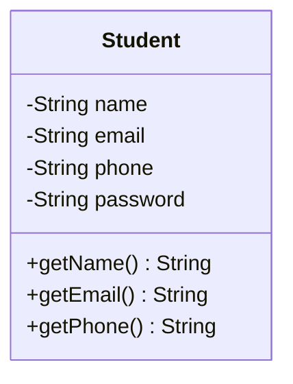
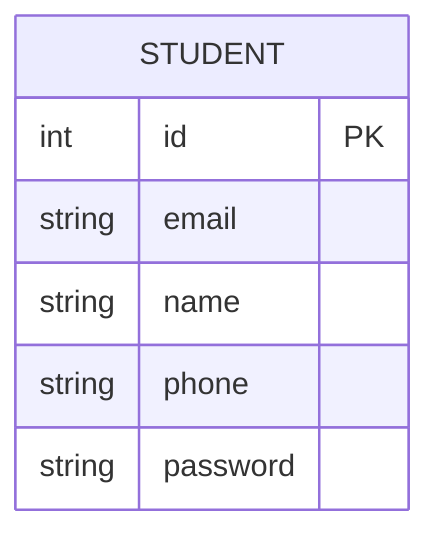
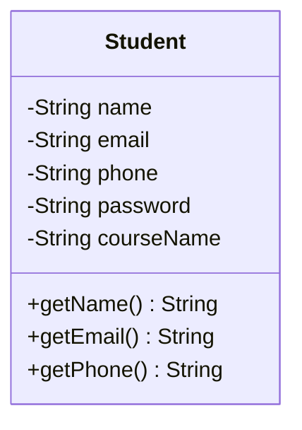
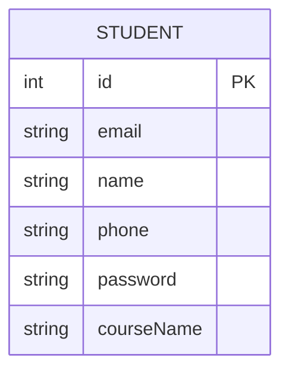
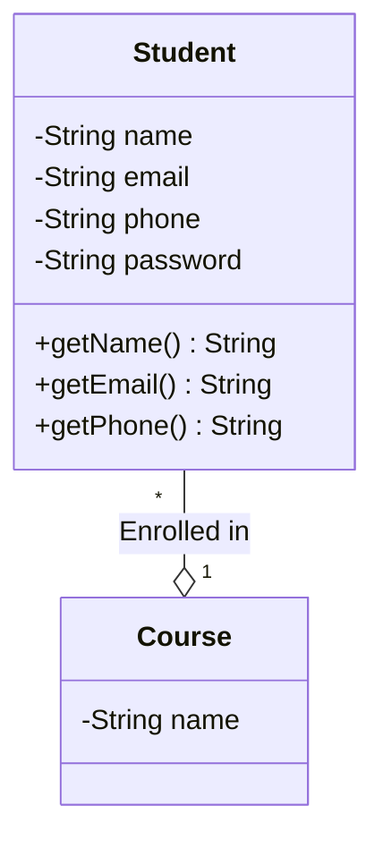
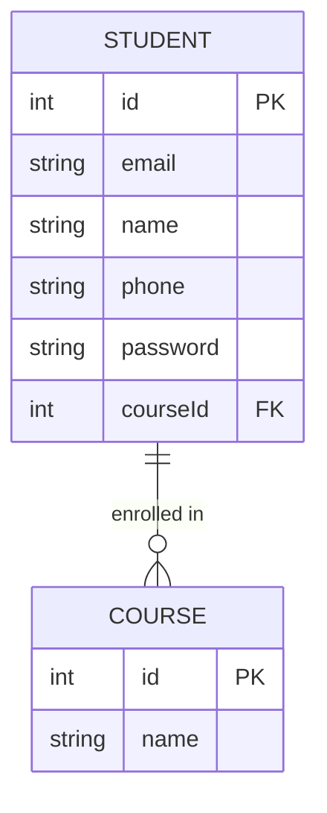

# ReScaler - A case study

## Version 1
Following are the requirements of the ReScaler application:
* A student should be able to login with their email address and password.
* Students should be able to view their profile which includes their name, email address and phone number.

### Solution

#### Class Diagram

### Database Schema

## Version 2

* We will provide multiple courses as a part of the ReScaler application.
* Every student can enroll for a single course.
* Every course has a name.

### Solution 1 - Course Name as an attribute

#### Class Diagram

#### Database Schema

Disadvantages:
* The student can only enroll for a single course.
* Course name is duplicated for every student in the same course. This is a waste of space.
* Updating the course name for all the students is a tedious task.
* Course cannot exist without a student. Our design is subject to database anomalies.

### Solution 2 - Course as a separate entity

#### Class Diagram

#### Database Schema

