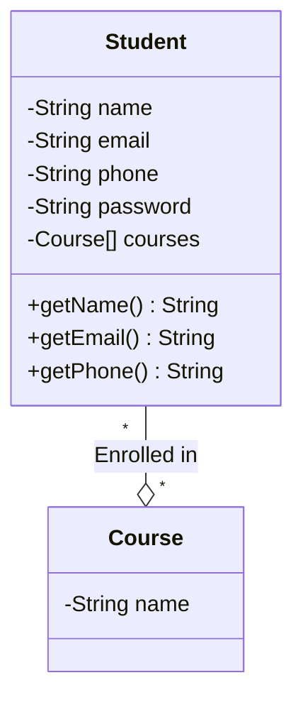
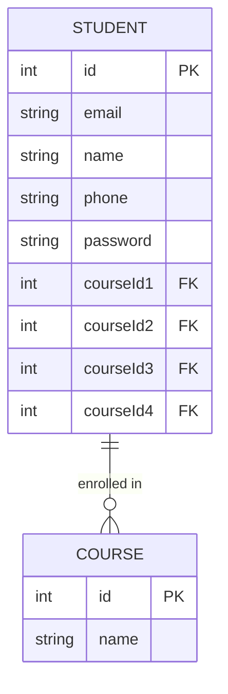
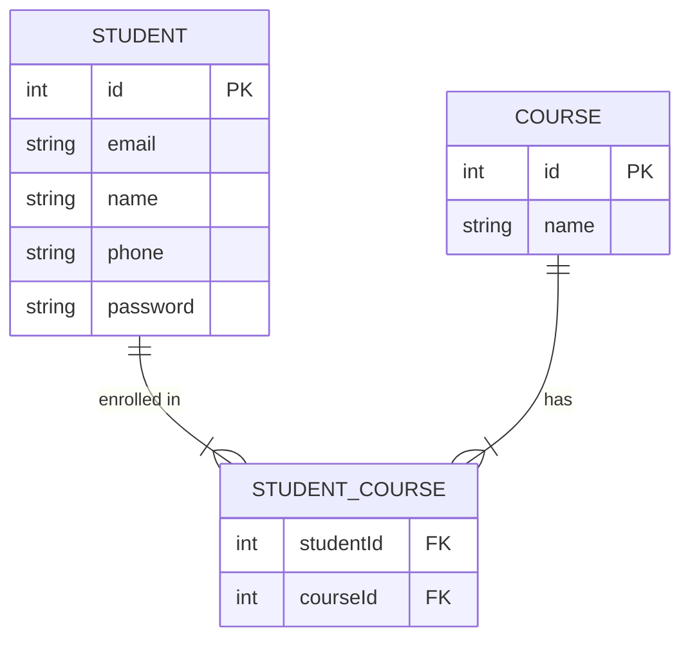
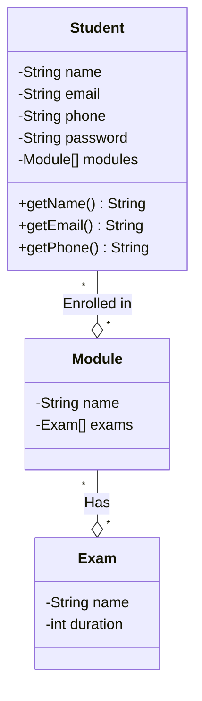
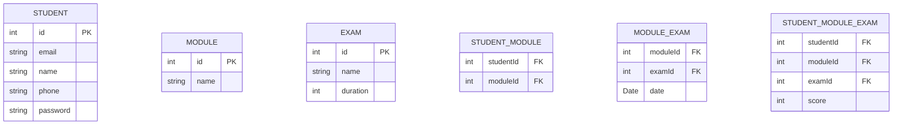

# ReScaler - A case study

## Version 1
Following are the requirements of the ReScaler application:
* A student should be able to login with their email address and password.
* Students should be able to view their profile which includes their name, email address and phone number.

### Solution

#### Class Diagram

### Database Schema

---

## Version 2

* We will provide multiple courses as a part of the ReScaler application.
* Every student can enroll for a single course.
* Every course has a name.

### Solution 1 - Course Name as an attribute

#### Class Diagram

#### Database Schema

Disadvantages:
* The student can only enroll for a single course.
* Course name is duplicated for every student in the same course. This is a waste of space.
* Updating the course name for all the students is a tedious task.
* Course cannot exist without a student. Our design is subject to database anomalies.

### Solution 2 - Course as a separate entity

#### Class Diagram

#### Database Schema

---

## Version 3
* Each student can enroll for **exactly 4** courses

### Solution 1 - Multiple course ID columns

#### Class Diagram

#### Database Schema

Disadvantages:
* `Extensibility` - The student can enroll for only 4 courses.
* `Querying` - We need to write a query to get all the course columns for a student to identify the courses they are enrolled in.

### Solution 2 - Separate table for student-course mapping

#### Class Diagram

#### Database Schema

## Version 4

* ReScaler will provide different modules for students to learn i.e. Data Structures, Algorithms, etc.
* Each student can enroll for multiple modules.
* Each module will have multiple exams.
* Each exam has a name and a duration.
* One exam can be part of multiple modules.
* For each exam, the student will be given a score.

### Solution

#### Class Diagram

#### Database Schema

##### Just tables

